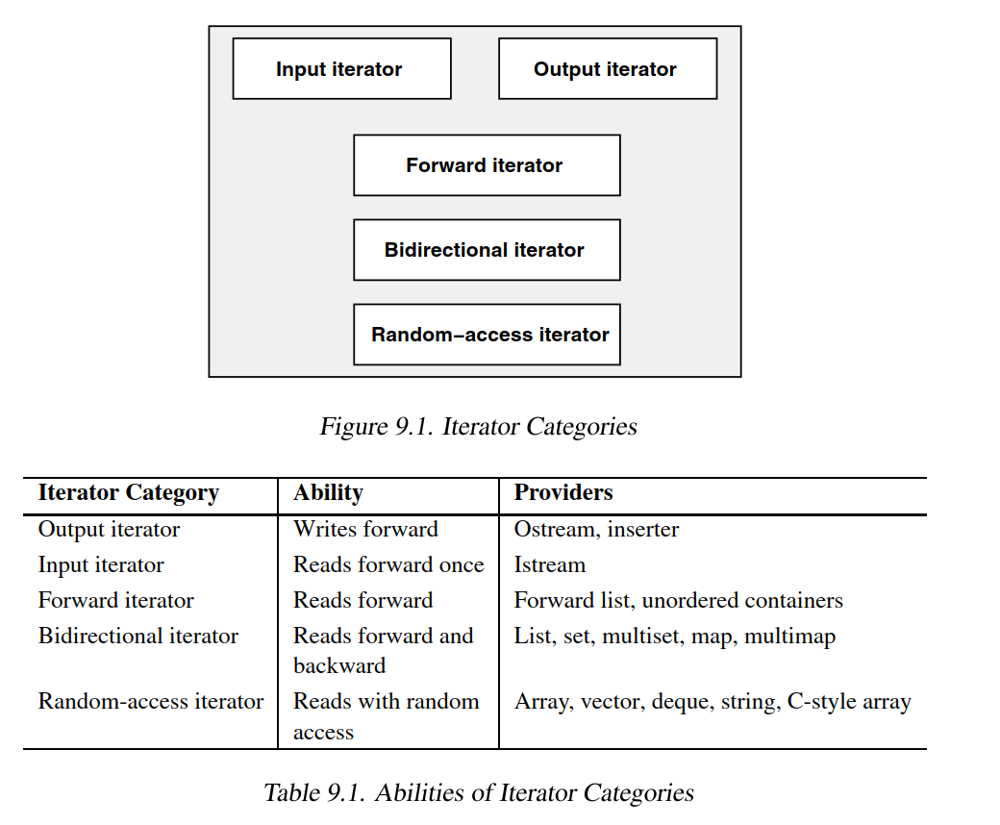

# Iterator Categories

## Learning Objectives

After completing this chapter, you should be able to:

* Explain why iterator categories exist
* Understand the iterator hierarchy
* Identify which containers provide which iterator categories
* Explain algorithm iterator requirements
* Understand the relationship between iterator capability and algorithm complexity
* Answer common iterator hierarchy interview questions

---

# Why Iterator Categories Exist

Not all iterators provide the same capabilities.

For example:

```cpp
std::vector<int>::iterator
```

supports:

```cpp
it + 5
it - 5
it[3]
```

while:

```cpp
std::list<int>::iterator
```

does not.

Similarly:

```cpp
std::istream_iterator<int>
```

can only move forward and read values once.

Because different iterators provide different capabilities, the STL organizes them into categories.

Algorithms can then specify the minimum iterator category they require.

---

# Iterator Hierarchy

The iterator categories defined by the STL are:



Important:

Output Iterators form a separate category because they are write-oriented rather than read-oriented.

---

# Why Categories Matter

Consider:

```cpp
std::find(first, last, value);
```

The algorithm only needs:

```cpp
*it
++it
it != last
```

Therefore it can work with a very weak iterator category.

Now consider:

```cpp
std::sort(first, last);
```

The algorithm needs:

```cpp
it + n
last - first
```

Therefore it requires a stronger iterator category.

The STL uses iterator categories to express these requirements.

---

# Iterator Categories Overview

| Category                    | Ability                           | Typical Providers                   |
| --------------------------- | --------------------------------- | ----------------------------------- |
| Output Iterator             | Write forward                     | ostream_iterator, inserters         |
| Input Iterator              | Read forward once                 | istream_iterator                    |
| Forward Iterator            | Read forward multiple times       | forward_list, unordered containers  |
| Bidirectional Iterator      | Read forward and backward         | list, set, multiset, map, multimap  |
| Random Access Iterator      | Read with random access           | vector, deque, array, string        |
| Contiguous Iterator (C++20) | Random access + contiguous memory | vector, array, string, raw pointers |

---

# Output Iterator

Purpose:

```text
Write values into a destination.
```

Typical examples:

```cpp
std::ostream_iterator
std::back_insert_iterator
std::front_insert_iterator
std::insert_iterator
```

Typical operation:

```cpp
*it = value;
```

Output Iterators are write-oriented.

---

# Input Iterator

Purpose:

```text
Read values while moving forward.
```

Typical examples:

```cpp
std::istream_iterator
```

Typical operations:

```cpp
*it
++it
```

Input Iterators are generally considered single-pass iterators.

---

# Forward Iterator

Purpose:

```text
Read forward multiple times.
```

Examples:

```cpp
std::forward_list
std::unordered_set
std::unordered_map
```

Adds:

```text
Multi-pass guarantee
```

Copies of a Forward Iterator remain independently usable.

---

# Bidirectional Iterator

Purpose:

```text
Move both forward and backward.
```

Examples:

```cpp
std::list
std::set
std::map
```

Adds:

```cpp
--it
```

This enables reverse traversal.

---

# Random Access Iterator

Purpose:

```text
Jump directly to any position.
```

Examples:

```cpp
std::vector
std::deque
std::array
std::string
```

Adds:

```cpp
it + n
it - n
it[n]
```

and constant-time distance calculation.

---

# Contiguous Iterator (C++20)

Purpose:

```text
Guarantee contiguous memory layout.
```

Examples:

```cpp
std::vector
std::array
std::string
int*
```

Additional guarantee:

```cpp
&*(it + n)
```

behaves like:

```cpp
std::addressof(*it) + n
```

This enables low-level memory optimizations.

---

# Category Capability Comparison

| Operation         | Output | Input | Forward | Bidirectional | Random Access | Contiguous |
| ----------------- | ------ | ----- | ------- | ------------- | ------------- | ---------- |
| Read (*it)        | No     | Yes   | Yes     | Yes           | Yes           | Yes        |
| Write (*it=value) | Yes    | No    | Usually | Usually       | Usually       | Usually    |
| ++it              | Yes    | Yes   | Yes     | Yes           | Yes           | Yes        |
| --it              | No     | No    | No      | Yes           | Yes           | Yes        |
| it + n            | No     | No    | No      | No            | Yes           | Yes        |
| it[n]             | No     | No    | No      | No            | Yes           | Yes        |
| Multi-pass        | No     | No    | Yes     | Yes           | Yes           | Yes        |
| Contiguous Memory | No     | No    | No      | No            | No            | Yes        |

---

# Iterator Categories and Algorithms

Algorithms specify the minimum iterator category they require.

Examples:

| Algorithm     | Minimum Requirement     |
| ------------- | ----------------------- |
| find          | Input Iterator          |
| count         | Input Iterator          |
| copy          | Input + Output Iterator |
| reverse       | Bidirectional Iterator  |
| binary_search | Random Access Iterator  |
| sort          | Random Access Iterator  |

This is one of the key design principles of STL.

---

# Interview Questions

## Q1

Why does std::sort() work on std::vector but not std::list?

Answer:

`std::sort()` requires Random Access Iterators.

`std::vector` provides Random Access Iterators.

`std::list` provides Bidirectional Iterators.

---

## Q2

What is the difference between Input Iterator and Forward Iterator?

Answer:

Forward Iterators provide the multi-pass guarantee.

Input Iterators do not.

---

## Q3

Why is Output Iterator separate from the hierarchy?

Answer:

Because Output Iterators are write-oriented while the other iterator categories are read-oriented.

---

## Q4

What category does std::vector::iterator belong to?

Answer:

```text
Input
Forward
Bidirectional
Random Access
Contiguous
```

because iterator categories build upon one another.

---

## Q5

What category does std::list::iterator belong to?

Answer:

```text
Input
Forward
Bidirectional
```

but not Random Access.

---

# Key Takeaways

1. Iterator categories describe iterator capabilities.
2. Stronger iterator categories support more operations.
3. Output Iterators are separate from the read-oriented hierarchy.
4. Algorithms specify minimum iterator requirements.
5. Iterator categories directly influence algorithm complexity.
6. Understanding iterator categories is essential for STL design and interview preparation.
