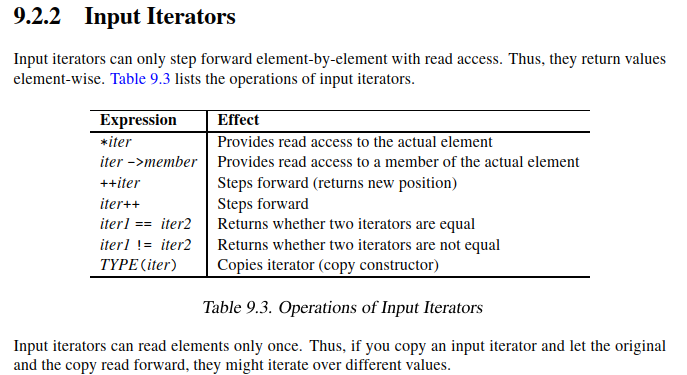

# Input Iterator

## Learning Objectives

After completing this chapter, you should be able to:

* Explain what an Input Iterator is
* Understand why Input Iterators are single-pass iterators
* Understand the difference between Input Iterators and Output Iterators
* Explain the difference between Input Iterators and Forward Iterators
* Understand why many STL algorithms require only Input Iterators
* Understand the operations supported by Input Iterators
* Answer common Input Iterator interview questions

---

# What is an Input Iterator?

An Input Iterator is an iterator that provides read access while moving forward through a sequence.


Conceptually:

```text
Source
   |
   v
Input Iterator
   |
   v
Algorithm
```

Examples of sources:

```text
Container
File
Console Input
Network Stream
Generated Sequence
```

Input Iterators are used to read values one element at a time.

---

# Why Are They Called Input Iterators?

Historically, Input Iterators were designed to model reading from input streams.

A typical example is:

```cpp
std::istream_iterator<int>
```

which can read values from:

```cpp
std::cin
std::ifstream
```

Example:

```cpp
std::istream_iterator<int> first(std::cin);
std::istream_iterator<int> last;
```

The iterator extracts values from the stream as it advances.

---

# Supported Operations

Input Iterators support:

```cpp
*iter
```

Provides read access to the current element.

```cpp
iter->member
```

Provides read access to a member of the current element.

```cpp
++iter
```

Advances the iterator and returns the new position.

```cpp
iter++
```

Advances the iterator.

```cpp
iter1 == iter2
```

Tests whether two iterators compare equal.

```cpp
iter1 != iter2
```

Tests whether two iterators compare unequal.

```cpp
TYPE(iter)
```

Copy construction.

---

# Input Iterator Requirements

An algorithm requiring an Input Iterator may assume only the following operations:

```cpp
*iter
iter->member
++iter
iter++
iter == other
iter != other
```

An Input Iterator does not provide:

```cpp
--iter
iter + n
iter - n
iter[n]
```

These operations belong to stronger iterator categories.

This design allows Input Iterator algorithms to work with a wide variety of data sources, including streams.

---

# Typical Usage Pattern

```cpp
InputIterator pos, end;

while (pos != end)
{
    auto value = *pos;

    ++pos;
}
```

Input Iterators are intended for sequential reading.

---

# Single-Pass Nature

This is the most important property of Input Iterators.

Input Iterators are single-pass iterators.

Unlike stronger iterator categories, Input Iterators do not provide a multi-pass guarantee.

Consider:

```cpp
auto a = first;
auto b = first;
```

Now:

```cpp
++a;
```

For an Input Iterator, the standard does not guarantee that `b` remains an independent traversal position.

In other words, copies of an Input Iterator are not required to behave as independent iterators over the same sequence.

This is why Input Iterators are called single-pass iterators.

The canonical example is:

```cpp
std::istream_iterator
```

where advancing one iterator may consume input from the underlying stream and affect all copies referring to that stream position.

---

# Why?

Imagine reading from a file:

```text
10 20 30 40
```

Suppose:

```cpp
std::istream_iterator<int> first(stream);
```

Reading:

```cpp
++first;
```

consumes data from the stream.

The underlying stream state changes.

Copies of the iterator are therefore not guaranteed to remain independent traversal positions.

This is why Input Iterators are considered single-pass iterators.

---

# Example: istream_iterator

```cpp
#include <iostream>
#include <iterator>

int main()
{
    std::istream_iterator<int> first(std::cin);
    std::istream_iterator<int> last;

    while (first != last)
    {
        std::cout << *first << '\n';

        ++first;
    }
}
```

Input:

```text
1 2 3 4
```

Output:

```text
1
2
3
4
```

---

# Iterator Comparisons

Input Iterators provide:

```cpp
iter1 == iter2
iter1 != iter2
```

These operations are primarily used to determine whether an iterator has reached a past-the-end position.

Typical usage:

```cpp
InputIterator pos, end;

while (pos != end)
{
    ++pos;
}
```

The equality comparison requirements for Input Iterators are intentionally weaker than those for Forward Iterators.

Input Iterators are primarily compared against a past-the-end iterator to determine when traversal should stop.

Algorithms should not rely on stronger comparison guarantees.

---

# Prefer Preincrement

For Input Iterators, it is generally better to write:

```cpp
++iter;
```

rather than:

```cpp
iter++;
```

The postincrement operator must return the iterator's previous state, which may require additional work compared to preincrement.

For iterator types more complex than raw pointers, this can result in unnecessary overhead.

For this reason, STL code typically prefers preincrement whenever the previous value is not needed.

Example:

```cpp
++pos;   // preferred
```

instead of:

```cpp
pos++;   // valid, but potentially less efficient
```

---

# Why Many Algorithms Require Only Input Iterators

Consider:

```cpp
std::find()
```

A simplified implementation:

```cpp
while (first != last)
{
    if (*first == value)
        return first;

    ++first;
}
```

Required operations:

```cpp
*first
++first
first != last
```

Nothing more.

Therefore Input Iterators are sufficient.

---

# Examples of Algorithms Requiring Input Iterators

```cpp
std::find
std::count
std::count_if
std::all_of
std::any_of
std::none_of
```

These algorithms only need to traverse a sequence once.

---

# Typical Input Iterator Sources

Common Input Iterator types include:

```cpp
std::istream_iterator
```

Input streams:

```cpp
std::cin
std::ifstream
```

Custom generators and stream-like data sources can also model Input Iterators.

Most container iterators satisfy stronger categories, but they can still be used wherever an Input Iterator is required.

---

# Input Iterator vs Output Iterator

| Feature      | Input Iterator | Output Iterator |
| ------------ | -------------- | --------------- |
| Read Values  | Yes            | No              |
| Write Values | Not Required   | Yes             |
| Move Forward | Yes            | Yes             |
| Single-Pass  | Yes            | Yes             |
| Typical Role | Source         | Destination     |

---

# Input Iterator vs Forward Iterator

This is an important distinction.

Forward Iterators provide a:

```text
Multi-pass guarantee
```

Input Iterators do not.

Consider:

```cpp
auto a = first;
auto b = first;

++a;
```

For a Forward Iterator:

```cpp
b
```

remains valid and independent.

For an Input Iterator:

```cpp
b
```

is not guaranteed to remain independently usable.

This is the key difference between Input Iterators and Forward Iterators.

---

# Real STL Insight

Many STL algorithms intentionally require only Input Iterators.

This allows them to work with:

```cpp
std::istream_iterator
std::vector<int>::iterator
std::list<int>::iterator
std::set<int>::iterator
raw pointers
```

A weaker requirement means greater flexibility.

This is one of the key design principles of the STL.

---

# Interview Trap

## Question

Why isn't `std::istream_iterator` a Forward Iterator?

## Answer

Because advancing one iterator may consume data from the underlying stream.

Copies of the iterator cannot be guaranteed to behave as independent traversal positions.

Therefore it satisfies only the Input Iterator requirements and not the Forward Iterator requirements.

---

# Interview Trap

## Question

If a Forward Iterator can also move only forward, why does STL need both Input Iterator and Forward Iterator?

## Answer

Because Forward Iterators provide the multi-pass guarantee.

Input Iterators only guarantee a single traversal of the sequence.

Forward Iterators guarantee that multiple iterator copies can traverse the same sequence independently.

This additional guarantee enables more algorithms and stronger correctness assumptions.

---

# Interview Questions

## Q1

What is an Input Iterator?

**Answer:**

An iterator that provides read access while moving forward through a sequence.

---

## Q2

Why are Input Iterators called single-pass iterators?

**Answer:**

Because elements can generally be read only once, and copies of an Input Iterator are not guaranteed to provide independent traversal positions.

---

## Q3

What is the canonical example of an Input Iterator?

**Answer:**

```cpp
std::istream_iterator
```

---

## Q4

What operations does an Input Iterator support?

**Answer:**

```cpp
*iter
iter->member
++iter
iter++
iter1 == iter2
iter1 != iter2
TYPE(iter)
```

---

## Q5

Why should `++iter` usually be preferred over `iter++`?

**Answer:**

Because preincrement does not need to preserve the old iterator value and may therefore be more efficient.

---

## Q6

What is the key difference between an Input Iterator and a Forward Iterator?

**Answer:**

Forward Iterators provide a multi-pass guarantee; Input Iterators do not.

---

# Interview Summary

## Must Remember

* Input Iterators are read-oriented iterators.
* Input Iterators are single-pass iterators.
* Common example:

  * std::istream_iterator
* Required operations:

  * `*iter`
  * `iter->member`
  * `++iter`
  * comparison
* Many STL algorithms require only Input Iterators.
* Input Iterators do not provide the multi-pass guarantee.
* Forward Iterators extend Input Iterators by adding the multi-pass guarantee.

---

# Key Takeaways

1. Input Iterators provide read access while moving forward.
2. They are single-pass iterators.
3. Elements can generally be read only once.
4. `std::istream_iterator` is the canonical Input Iterator.
5. Input Iterators support reading, incrementing, and equality comparison.
6. Many STL algorithms require only Input Iterator capabilities.
7. Input Iterators do not provide the multi-pass guarantee.
8. Forward Iterators extend Input Iterators by adding the multi-pass guarantee.
9. Prefer `++iter` over `iter++` when the previous value is not needed.
