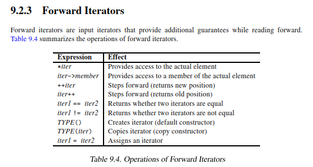

# Forward Iterator

## Learning Objectives

After completing this chapter, you should be able to:

* Explain what a Forward Iterator is
* Understand the multi-pass guarantee
* Explain the difference between Input Iterators and Forward Iterators
* Identify containers that provide Forward Iterators
* Understand mutable Forward Iterators
* Understand the operations supported by Forward Iterators
* Answer common Forward Iterator interview questions

---

# What is a Forward Iterator?

A Forward Iterator is an Input Iterator that provides additional guarantees while traversing a sequence.



Hierarchy:

```text
Input Iterator
      ↑
Forward Iterator
```

A Forward Iterator supports all Input Iterator operations and adds stronger semantic guarantees.

The most important additional guarantee is:

```text
Multi-Pass Guarantee
```

Unlike Input Iterators, Forward Iterators can be copied and used independently.

---

# Supported Operations

Forward Iterators support all Input Iterator operations:

```cpp
*iter
```

Provides access to the current element.

```cpp
iter->member
```

Provides access to a member of the current element.

```cpp
++iter
```

Advances the iterator and returns the new position.

```cpp
iter++
```

Advances the iterator and returns the old position.

```cpp
iter1 == iter2
```

Tests whether two iterators compare equal.

```cpp
iter1 != iter2
```

Tests whether two iterators compare unequal.

In addition, Forward Iterators support:

```cpp
TYPE()
```

Default construction.

```cpp
TYPE(iter)
```

Copy construction.

```cpp
iter1 = iter2
```

Assignment.

---

# The Defining Feature: Multi-Pass Guarantee

The defining characteristic of a Forward Iterator is the multi-pass guarantee.

Input Iterators:

```text
Single Pass
```

Forward Iterators:

```text
Multi Pass
```

This means that multiple copies of a Forward Iterator may be used independently to traverse the same sequence.

---

# Understanding the Multi-Pass Guarantee

Suppose:

```cpp
auto pos1 = first;
auto pos2 = first;
```

Initially:

```cpp
pos1 == pos2
```

Both iterators refer to the same element.

If both iterators are incremented:

```cpp
++pos1;
++pos2;
```

they will again refer to the same element.

The standard guarantees consistent and independent traversal.

Example:

```cpp
ForwardIterator pos1, pos2;

pos1 = pos2 = begin;

if (pos1 != end)
{
    ++pos1;

    while (pos1 != end)
    {
        if (*pos1 == *pos2)
        {
            // process adjacent duplicates
        }

        ++pos1;
        ++pos2;
    }
}
```

This pattern is valid for Forward Iterators.

It is not guaranteed to work for Input Iterators.

---

# Why Input Iterators Cannot Guarantee This

Consider:

```cpp
std::istream_iterator<int>
```

Reading:

```cpp
++iter;
```

may consume data from the underlying stream.

The stream state changes.

Therefore:

```cpp
auto a = first;
auto b = first;
```

does not guarantee independent traversal.

This is why stream iterators satisfy only the Input Iterator requirements.

---

# Mutable Forward Iterators

A Forward Iterator that also satisfies Output Iterator requirements is called a mutable Forward Iterator.

Such iterators support both reading and writing.

Example:

```cpp
std::forward_list<int> fl{1,2,3};

auto it = fl.begin();

int value = *it; // read

*it = 42;        // write
```

A mutable Forward Iterator satisfies:

```text
Input Iterator requirements
```

and

```text
Output Iterator requirements
```

simultaneously.

---

# Providers of Forward Iterators

The canonical Forward Iterator container is:

```cpp
std::forward_list
```

Unordered associative containers also provide Forward Iterators:

```cpp
std::unordered_set
std::unordered_map
std::unordered_multiset
std::unordered_multimap
```

These containers support repeated traversal while only allowing forward movement.

---

# Example: forward_list

```cpp
#include <forward_list>
#include <iostream>

int main()
{
    std::forward_list<int> fl{10,20,30,40};

    auto a = fl.begin();
    auto b = fl.begin();

    ++a;

    std::cout << *a << '\n';
    std::cout << *b << '\n';
}
```

Output:

```text
20
10
```

Both iterators remain valid and independently usable.

---

# Why Not Bidirectional?

Consider:

```cpp
std::forward_list
```

Internally it is implemented as a singly linked list.

A node typically contains:

```cpp
struct Node
{
    T value;
    Node* next;
};
```

Only a pointer to the next node exists.

There is no pointer to the previous node.

Therefore:

```cpp
--iter
```

cannot be supported efficiently.

This is why `std::forward_list` provides Forward Iterators rather than Bidirectional Iterators.

---

# Why Some Algorithms Require Forward Iterators

Certain algorithms need stronger guarantees than Input Iterators provide.

For example:

```text
Multiple passes over a range
```

or

```text
Multiple iterator copies
```

that remain independently usable.

Examples:

```cpp
std::unique
std::remove
std::partition
```

These algorithms depend on the multi-pass guarantee.

---

# Input Iterator vs Forward Iterator

| Feature               | Input Iterator | Forward Iterator |
| --------------------- | -------------- | ---------------- |
| Read Access           | Yes            | Yes              |
| Move Forward          | Yes            | Yes              |
| Single-Pass           | Yes            | No               |
| Multi-Pass Guarantee  | No             | Yes              |
| Independent Copies    | No             | Yes              |
| Default Constructible | Not Required   | Yes              |
| Assignable            | Not Required   | Yes              |

---

# Forward Iterator vs Bidirectional Iterator

| Feature                         | Forward Iterator | Bidirectional Iterator |
| ------------------------------- | ---------------- | ---------------------- |
| `++iter`                        | Yes              | Yes                    |
| `--iter`                        | No               | Yes                    |
| Multi-Pass Guarantee            | Yes              | Yes                    |
| Independent Copies              | Yes              | Yes                    |
| Read Access                     | Yes              | Yes                    |
| Write Access (mutable versions) | Yes              | Yes                    |

---

# Real STL Insight

Many developers think:

```cpp
std::forward_list
```

is simply a smaller version of:

```cpp
std::list
```

The key difference is the iterator category.

```text
std::forward_list  → Forward Iterator
std::list          → Bidirectional Iterator
```

This affects:

* Supported operations
* Algorithm compatibility
* Complexity guarantees

---

# Interview Trap

## Question

If Forward Iterators can only move forward, why aren't they just Input Iterators?

### Answer

Because Forward Iterators provide the multi-pass guarantee.

Multiple iterator copies can traverse the same sequence independently.

Input Iterators do not provide this guarantee.

---

## Question

Why isn't `std::istream_iterator` a Forward Iterator?

### Answer

Because advancing the iterator may consume data from the underlying stream.

Copies of the iterator cannot be guaranteed to remain independent traversal positions.

Therefore it satisfies only the Input Iterator requirements.

---

## Question

Why does `std::forward_list` provide Forward Iterators instead of Bidirectional Iterators?

### Answer

Because it is implemented as a singly linked list.

Nodes contain only a pointer to the next node.

There is no efficient way to support:

```cpp
--iter
```

---

# Interview Questions

## Q1

What additional guarantee does a Forward Iterator provide?

**Answer:**

The multi-pass guarantee.

---

## Q2

What is the canonical container providing Forward Iterators?

**Answer:**

```cpp
std::forward_list
```

---

## Q3

Can copies of a Forward Iterator be used independently?

**Answer:**

Yes.

That is one of the guarantees provided by Forward Iterators.

---

## Q4

What is a mutable Forward Iterator?

**Answer:**

A Forward Iterator that satisfies both Input Iterator and Output Iterator requirements, allowing both reading and writing.

---

## Q5

Does a Forward Iterator support:

```cpp
--iter
```

?

**Answer:**

No.

Backward movement requires a Bidirectional Iterator.

---

# Interview Summary

## Must Remember

* Forward Iterator extends Input Iterator.
* The defining feature is the multi-pass guarantee.
* Multiple copies remain independently usable.
* Canonical example:

  * `std::forward_list`
* Supports:

  * `*iter`
  * `++iter`
  * comparison
* Does not support:

  * `--iter`
  * `iter + n`
* Stronger than Input Iterator.
* Weaker than Bidirectional Iterator.

---

# Key Takeaways

1. A Forward Iterator is an Input Iterator with additional guarantees.
2. The defining feature is the multi-pass guarantee.
3. Multiple iterator copies remain independently usable.
4. If two Forward Iterators compare equal, incrementing both preserves their relative position.
5. Forward Iterators support default construction, copying, and assignment.
6. `std::forward_list` is the canonical Forward Iterator container.
7. Unordered associative containers provide Forward Iterators.
8. Mutable Forward Iterators support both reading and writing.
9. Forward Iterators are stronger than Input Iterators but weaker than Bidirectional Iterators.
10. Forward Iterators support only forward movement.
