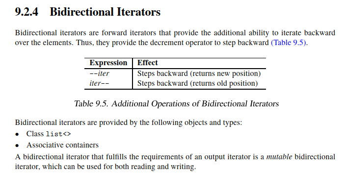

# Bidirectional Iterator

## Learning Objectives

After completing this chapter, you should be able to:

* Explain what a Bidirectional Iterator is
* Understand how Bidirectional Iterators extend Forward Iterators
* Understand forward and backward traversal
* Identify containers that provide Bidirectional Iterators
* Understand mutable Bidirectional Iterators
* Explain why some algorithms require Bidirectional Iterators
* Understand the relationship between Bidirectional Iterators and Reverse Iterators
* Answer common Bidirectional Iterator interview questions

---

# What is a Bidirectional Iterator?

A Bidirectional Iterator is a Forward Iterator that provides the additional ability to traverse a sequence in both directions.


Hierarchy:

```text
Input Iterator
      ↑
Forward Iterator
      ↑
Bidirectional Iterator
```

A Bidirectional Iterator supports all operations of a Forward Iterator and adds backward traversal.

The defining feature is:

```cpp
--iter
```

---

# Additional Operations

Bidirectional Iterators support all Forward Iterator operations.

In addition, they support:

```cpp
--iter
```

Moves to the previous element and returns the new position.

```cpp
iter--
```

Moves to the previous element and returns the old position.

These are the only additional operations required beyond those of a Forward Iterator.

---

# Forward and Backward Traversal

Forward traversal:

```cpp
++iter;
```

moves to the next element.

Backward traversal:

```cpp
--iter;
```

moves to the previous element.

Example:

```text
10 <-> 20 <-> 30 <-> 40
```

Suppose:

```cpp
auto it = container.begin();
```

After:

```cpp
++it;
```

the iterator refers to:

```text
20
```

After:

```cpp
--it;
```

the iterator again refers to:

```text
10
```

---

# Multi-Pass Guarantee

Bidirectional Iterators inherit the multi-pass guarantee from Forward Iterators.

Suppose:

```cpp
auto pos1 = first;
auto pos2 = first;
```

Initially:

```cpp
pos1 == pos2
```

Both iterators refer to the same element.

If both iterators are incremented:

```cpp
++pos1;
++pos2;
```

they continue to refer to the same element.

Copies of a Bidirectional Iterator remain independently usable.

---

# Mutable Bidirectional Iterators

A Bidirectional Iterator that also fulfills the requirements of an Output Iterator is called a mutable Bidirectional Iterator.

Such an iterator can be used for both reading and writing.

Example:

```cpp
std::list<int> lst{1,2,3};

auto it = lst.begin();

int value = *it; // read

*it = 42;        // write
```

A mutable Bidirectional Iterator satisfies both:

```text
Input Iterator requirements
```

and

```text
Output Iterator requirements
```

and therefore supports both reading and writing.

---

# Providers of Bidirectional Iterators

Bidirectional Iterators are provided by:

```cpp
std::list
```

and ordered associative containers:

```cpp
std::set
std::multiset

std::map
std::multimap
```

These iterators support both forward and backward traversal.

---

# Why std::list Supports Bidirectional Iterators

A typical doubly linked list node contains:

```cpp
struct Node
{
    T value;

    Node* next;
    Node* prev;
};
```

Because both:

```cpp
next
prev
```

are available, the iterator can efficiently support:

```cpp
++iter
--iter
```

This naturally satisfies the Bidirectional Iterator requirements.

---

# Why std::forward_list Is Not Bidirectional

Consider:

```cpp
std::forward_list
```

A typical node contains:

```cpp
struct Node
{
    T value;

    Node* next;
};
```

Only a pointer to the next node exists.

There is no pointer to the previous node.

Therefore:

```cpp
--iter
```

cannot be implemented efficiently.

This is why `std::forward_list` provides Forward Iterators rather than Bidirectional Iterators.

---

# Example: list

```cpp
#include <list>
#include <iostream>

int main()
{
    std::list<int> lst{10,20,30,40};

    auto it = lst.begin();

    ++it;

    std::cout << *it << '\n';

    --it;

    std::cout << *it << '\n';
}
```

Output:

```text
20
10
```

The iterator can move in both directions.

---

# Example: Reverse Traversal

```cpp
#include <list>
#include <iostream>

int main()
{
    std::list<int> lst{10,20,30,40};

    auto it = lst.end();

    while (it != lst.begin())
    {
        --it;

        std::cout << *it << ' ';
    }
}
```

Output:

```text
40 30 20 10
```

This traversal is possible because Bidirectional Iterators support decrement operations.

---

# Algorithms Requiring Bidirectional Iterators

Some algorithms require the ability to move backward.

Examples:

```cpp
std::reverse
std::reverse_copy
```

These algorithms depend on:

```cpp
++iter
--iter
```

and therefore cannot work with Forward Iterators.

---

# Why std::reverse Requires Bidirectional Iterators

A simplified implementation looks like:

```cpp
while (first != last)
{
    --last;

    if (first == last)
        break;

    std::iter_swap(first, last);

    ++first;
}
```

Notice the use of:

```cpp
--last
```

Without backward movement, the algorithm cannot work.

Therefore:

```cpp
std::reverse()
```

requires Bidirectional Iterators.

---

# Forward Iterator vs Bidirectional Iterator

| Feature                         | Forward Iterator | Bidirectional Iterator |
| ------------------------------- | ---------------- | ---------------------- |
| Read Access                     | Yes              | Yes                    |
| Write Access (mutable versions) | Yes              | Yes                    |
| `++iter`                        | Yes              | Yes                    |
| `--iter`                        | No               | Yes                    |
| Multi-Pass Guarantee            | Yes              | Yes                    |
| Independent Copies              | Yes              | Yes                    |

---

# Bidirectional Iterator vs Random Access Iterator

| Feature            | Bidirectional Iterator | Random Access Iterator |
| ------------------ | ---------------------- | ---------------------- |
| `++iter`           | Yes                    | Yes                    |
| `--iter`           | Yes                    | Yes                    |
| `iter + n`         | No                     | Yes                    |
| `iter - n`         | No                     | Yes                    |
| `iter[n]`          | No                     | Yes                    |
| Constant-Time Jump | No                     | Yes                    |

Random Access Iterators provide all Bidirectional Iterator capabilities plus arbitrary jumps.

---

# Relationship to Reverse Iterators

Reverse Iterators are built on top of Bidirectional Iterators.

Example:

```cpp
container.rbegin()
container.rend()
```

Internally:

```cpp
std::reverse_iterator
```

uses decrement operations on the underlying iterator to traverse a sequence in reverse order.

This is why Bidirectional Iterators are the minimum requirement for Reverse Iterators.

---

# Real STL Insight

Many developers assume:

```cpp
std::set
```

supports:

```cpp
iter + 5
```

because it can move both forward and backward.

This is incorrect.

Bidirectional Iterators support:

```cpp
++iter
--iter
```

only.

Arbitrary jumps belong to Random Access Iterators.

---

# Interview Trap

## Question

Why does `std::reverse()` work on `std::list` but not on `std::forward_list`?

### Answer

`std::reverse()` requires Bidirectional Iterators because it needs:

```cpp
--iter
```

`std::list` provides Bidirectional Iterators.

`std::forward_list` provides only Forward Iterators.

---

## Question

Why does `std::list` provide Bidirectional Iterators?

### Answer

Because a doubly linked list contains both:

```cpp
next
prev
```

links, enabling efficient forward and backward traversal.

---

## Question

Can a Bidirectional Iterator perform:

```cpp
iter + 5
```

?

### Answer

No.

That operation requires a Random Access Iterator.

---

# Interview Questions

## Q1

What additional capability does a Bidirectional Iterator provide?

**Answer:**

Backward traversal using:

```cpp
--iter
```

and

```cpp
iter--
```

---

## Q2

Which standard containers provide Bidirectional Iterators?

**Answer:**

```cpp
std::list

std::set
std::multiset

std::map
std::multimap
```

---

## Q3

What is a mutable Bidirectional Iterator?

**Answer:**

A Bidirectional Iterator that satisfies both Input Iterator and Output Iterator requirements, allowing both reading and writing.

---

## Q4

Can a Bidirectional Iterator perform:

```cpp
iter + 5
```

?

**Answer:**

No.

That operation requires a Random Access Iterator.

---

## Q5

Does a Bidirectional Iterator provide the multi-pass guarantee?

**Answer:**

Yes.

It inherits the multi-pass guarantee from Forward Iterators.

---

# Interview Summary

## Must Remember

* Bidirectional Iterator extends Forward Iterator.
* The defining feature is:

```cpp
--iter
```

* Supports forward and backward traversal.
* Containers:

  * `std::list`
  * `std::set`
  * `std::map`
* Supports:

  * `++iter`
  * `--iter`
* Does not support:

  * `iter + n`
  * `iter[n]`
* Stronger than Forward Iterator.
* Weaker than Random Access Iterator.

---

# Key Takeaways

1. A Bidirectional Iterator is a Forward Iterator that supports backward traversal.
2. The additional operations are `--iter` and `iter--`.
3. Bidirectional Iterators inherit the multi-pass guarantee.
4. `std::list`, `std::set`, and `std::map` provide Bidirectional Iterators.
5. Mutable Bidirectional Iterators support both reading and writing.
6. `std::reverse()` requires Bidirectional Iterators.
7. Bidirectional Iterators are stronger than Forward Iterators but weaker than Random Access Iterators.
8. Bidirectional Iterators support movement in both directions but do not support arbitrary jumps.
