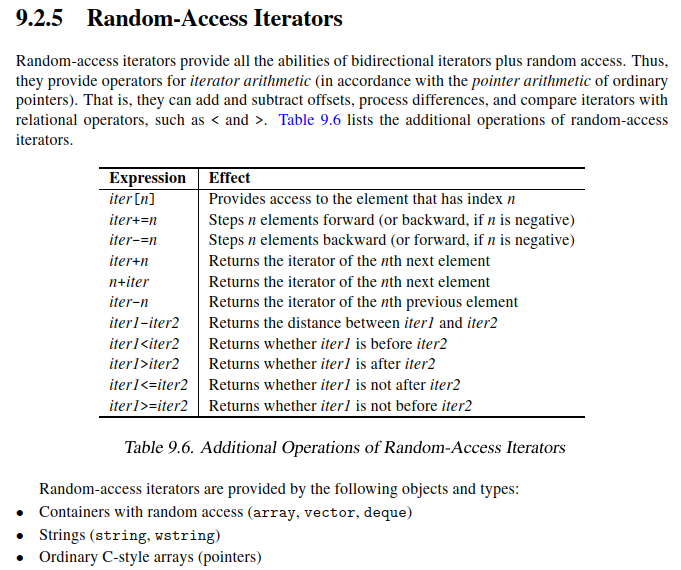

# What is a Random Access Iterator?

A Random Access Iterator is a Bidirectional Iterator that provides random access to elements.


Hierarchy:

```text
Input Iterator
      ↑
Forward Iterator
      ↑
Bidirectional Iterator
      ↑
Random Access Iterator
```

A Random Access Iterator supports all operations of a Bidirectional Iterator and adds iterator arithmetic similar to pointer arithmetic.

This allows an iterator to move multiple positions forward or backward in a single operation.

The defining characteristic is not merely the existence of these operations, but that they execute in constant time.

---

# Constant-Time Navigation

The defining characteristic of a Random Access Iterator is that navigation operations execute in constant time.

Example:

```cpp
auto it = v.begin();

it += 1000;
```

Complexity:

```text
O(1)
```

The iterator jumps directly to the target position.

This is what distinguishes Random Access Iterators from Bidirectional Iterators.

A Bidirectional Iterator can also move 1000 positions, but it must visit each intermediate element:

```cpp
for (int i = 0; i < 1000; ++i)
{
    ++it;
}
```

Complexity:

```text
O(n)
```

---

# Distance Calculation

Random Access Iterators support:

```cpp
iter1 - iter2
```

which returns the number of elements between two iterator positions.

Example:

```cpp
std::vector<int> v{10,20,30,40,50};

auto n = v.end() - v.begin();
```

Result:

```text
5
```

Complexity:

```text
O(1)
```

This is one of the biggest performance advantages of Random Access Iterators.

For weaker iterator categories:

```cpp
std::distance(first, last)
```

may require traversing the entire range.

Complexity:

```text
O(n)
```

---

# Why std::list Cannot Provide Random Access Iterators

Consider:

```cpp
std::list<int>
```

Internally:

```text
10 <-> 20 <-> 30 <-> 40
```

To move three positions forward:

```cpp
++it;
++it;
++it;
```

every intermediate node must be visited.

Complexity:

```text
O(n)
```

Therefore:

```cpp
it + 3
```

cannot be implemented efficiently.

For this reason, `std::list` provides Bidirectional Iterators rather than Random Access Iterators.

---

# Why std::sort() Requires Random Access Iterators

A sorting algorithm frequently performs operations such as:

```cpp
auto middle = first + (last - first) / 2;
```

This requires:

```cpp
first + n
last - first
```

Without Random Access Iterators these operations become inefficient or impossible.

Therefore:

```cpp
std::sort()
```

requires Random Access Iterators.

---

# Real STL Insight

Many developers believe:

```cpp
std::deque
```

is contiguous like:

```cpp
std::vector
```

This is incorrect.

Both provide:

```text
Random Access Iterators
```

but only:

```cpp
std::vector
std::array
std::string
```

provide contiguous storage.

Iterator category describes supported operations.

Memory layout is a separate concept.

This distinction becomes important when studying Contiguous Iterators.

---

# Interview Trap

## Question

Why does:

```cpp
std::sort(v.begin(), v.end());
```

compile, but:

```cpp
std::sort(lst.begin(), lst.end());
```

does not?

### Answer

`std::sort()` requires Random Access Iterators.

`std::vector` provides Random Access Iterators.

`std::list` provides only Bidirectional Iterators.

Therefore:

```cpp
lst.sort();
```

must be used instead.

---

# Interview Summary

## Must Remember

* Random Access Iterator extends Bidirectional Iterator.
* Supports:

  * `iter + n`
  * `iter - n`
  * `iter += n`
  * `iter -= n`
  * `iter[n]`
  * relational comparisons
* Navigation operations are constant time.
* Distance calculation using:

  * `last - first`
  * is O(1).
* Containers:

  * `std::vector`
  * `std::deque`
  * `std::array`
  * `std::string`
* Raw pointers are Random Access Iterators.
* `std::sort()` requires Random Access Iterators.
* Random Access does not imply contiguous storage.
* Stronger than Bidirectional Iterator.
* Weaker than Contiguous Iterator.

---

# Key Takeaways

1. A Random Access Iterator is a Bidirectional Iterator with constant-time arbitrary navigation.
2. The defining operations are `iter + n`, `iter - n`, and `iter[n]`.
3. Distance calculations can be performed in O(1) time.
4. Random Access Iterators enable efficient algorithms such as `std::sort()`.
5. `std::vector`, `std::deque`, `std::array`, and `std::string` provide Random Access Iterators.
6. Raw pointers are Random Access Iterators.
7. Random Access Iterators do not necessarily imply contiguous memory.
8. Contiguous Iterators add a stronger memory-layout guarantee on top of Random Access Iterators.
