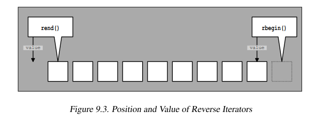
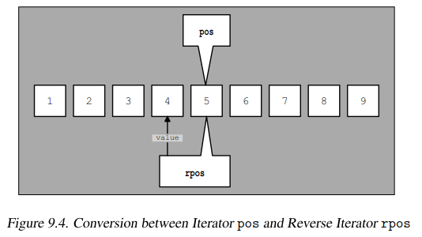

# Reverse Iterators

## Learning Objectives

After completing this chapter, you should be able to:

* Explain what a Reverse Iterator is
* Understand why Reverse Iterators exist
* Use `rbegin()`, `rend()`, `crbegin()`, and `crend()`
* Understand how Reverse Iterators reverse traversal direction
* Explain the relationship between Reverse Iterators and normal iterators
* Understand STL half-open ranges with Reverse Iterators
* Explain the distinction between physical position and logical position
* Convert between iterators and Reverse Iterators
* Use `base()` correctly
* Understand why `base()` appears one position ahead
* Use STL algorithms with Reverse Iterators
* Answer common Reverse Iterator interview questions

---

# What Is a Reverse Iterator?

A Reverse Iterator is an iterator adapter that reverses traversal direction.

Instead of traversing:

```text
begin() → end()
```

a Reverse Iterator traverses:

```text
rbegin() → rend()
```

which visits the elements in reverse order.

---

# Motivation

Consider:

```cpp
std::vector<int> v{10,20,30,40};
```

Normal traversal:

```cpp
for (auto it = v.begin();
     it != v.end();
     ++it)
{
    std::cout << *it << ' ';
}
```

Output:

```text
10 20 30 40
```

Reverse traversal without Reverse Iterators:

```cpp
for (auto it = v.end();
     it != v.begin();)
{
    --it;
    std::cout << *it << ' ';
}
```

Output:

```text
40 30 20 10
```

Correct, but awkward.

Reverse Iterators provide a cleaner abstraction.

---

# Using rbegin() and rend()

Most standard containers provide:

```cpp
rbegin()
rend()
```

as well as:

```cpp
crbegin()
crend()
```

for read-only traversal.

Example:

```cpp
for (auto rit = v.rbegin();
     rit != v.rend();
     ++rit)
{
    std::cout << *rit << ' ';
}
```

Output:

```text
40 30 20 10
```

---

# Reverse Iterators Reverse Traversal

For ordinary iterators:

```cpp
++it;
```

moves:

```text
10 → 20 → 30 → 40
```

For Reverse Iterators:

```cpp
++rit;
```

moves:

```text
40 → 30 → 20 → 10
```

This is often surprising the first time you see it.

---

# How Does It Work?

A Reverse Iterator wraps another iterator.

Conceptually:

```cpp
template<typename Iterator>
class reverse_iterator
{
private:
    Iterator current;
};
```

The stored iterator is called the **base iterator**.

---

# Why Does ++ Move Backward?

When you write:

```cpp
++rit;
```

the Reverse Iterator internally performs:

```cpp
--current;
```

Conceptually:

```cpp
reverse_iterator& operator++()
{
    --current;
    return *this;
}
```

Therefore:

```text
++rit
```

means:

```text
move backward in the underlying sequence
```

---

# Visual Model

Container:

```text
10    20    30    40
```

Forward traversal:

```text
begin() -----------------> end()
```

Reverse traversal:

```text
rend() <----------------- rbegin()
```

Using:

```cpp
++rit
```

visits:

```text
40 → 30 → 20 → 10
```

---

# Reverse Iterators and Half-Open Ranges

STL ranges are always represented as:

```cpp
[first,last)
```

meaning:

```text
first is included
last is excluded
```

Example:

```cpp
v.begin(), v.end()
```

represents:

```text
10 20 30 40
```

The same rule must remain true for Reverse Iterators.

Preserving this half-open range convention is the reason Reverse Iterators appear shifted by one position.

---

# The Most Important Rule

A Reverse Iterator does **not** refer to the same element as its base iterator.

The relationship is:

```text
*rit
    ==
element immediately before rit.base()
```

This is the single most important Reverse Iterator rule.

---

# Example

```cpp
std::vector<int> v{10,20,30,40};

auto rit = v.rbegin();
```

Then:

```cpp
*rit
```

is:

```text
40
```

while:

```cpp
rit.base()
```

is:

```cpp
v.end()
```

Notice:

```text
*rit      -> 40
rit.base  -> end()
```

They are not the same position.

---

# Why Is base() One Position Ahead?

Suppose:

```cpp
std::vector<int> v{10,20,30,40};

auto rit = v.rbegin();
```

Internally:

```cpp
rit.base() == v.end()
```

The Reverse Iterator obtains its value from the element immediately before the base iterator.

Conceptually:

```cpp
Iterator tmp = current;
--tmp;
return *tmp;
```

This design guarantees:

```cpp
v.rbegin().base() == v.end()
```

and:

```cpp
v.rend().base() == v.begin()
```

which makes range conversion consistent.

---

# Physical Position vs Logical Position
## Figure 9.3: Physical Position vs Logical Position



This is the key insight behind Reverse Iterators.

There are two different concepts:

## Physical Position

The actual iterator position stored internally.

## Logical Position

The value that appears to be referenced.

When converting:

```cpp
iterator -> reverse_iterator
```

the physical position is preserved.

The logical value changes.

---

# Example

```cpp
std::vector<int> v{1,2,3,4,5};

auto pos = std::find(
    v.begin(),
    v.end(),
    5);

std::cout << *pos;
```

Output:

```text
5
```

Convert:

```cpp
std::reverse_iterator rpos(pos);

std::cout << *rpos;
```

Output:

```text
4
```

The physical iterator position remains unchanged.

The logical value moves one element backward.

---

# Converting Iterators to Reverse Iterators

A Reverse Iterator can be created directly:

```cpp
auto pos = std::find(
    v.begin(),
    v.end(),
    5);

std::reverse_iterator rit(pos);
```

After conversion:

```cpp
*pos
```

is:

```text
5
```

while:

```cpp
*rit
```

is:

```text
4
```

This behavior is intentional.

---

# How rbegin() and rend() Are Implemented

Conceptually:

```cpp
rbegin()
```

is:

```cpp
reverse_iterator(end())
```

and:

```cpp
rend()
```

is:

```cpp
reverse_iterator(begin())
```

Therefore:

```cpp
v.rbegin().base() == v.end()
```

and:

```cpp
v.rend().base() == v.begin()
```

Almost every Reverse Iterator behavior follows from these two facts.

---

# Converting Back with base()

Every Reverse Iterator provides:

```cpp
rit.base()
```

which returns the underlying iterator.

Example:

```cpp
auto pos =
    std::find(
        v.begin(),
        v.end(),
        5);

std::reverse_iterator rpos(pos);

auto rrpos = rpos.base();
```

Then:

```text
*pos   = 5
*rpos  = 4
*rrpos = 5
```

The underlying iterator position is restored.

---

# Reverse Range Preservation



Consider:

```cpp
[pos1,pos2)
```

representing:

```text
2 3 4 5 6
```

Convert both iterators:

```cpp
reverse_iterator rpos1(pos1);
reverse_iterator rpos2(pos2);
```

The equivalent reverse range becomes:

```cpp
[rpos2,rpos1)
```

and produces:

```text
6 5 4 3 2
```

The range remains valid after conversion.

This is one reason the Reverse Iterator design is so elegant.

---

# Reverse Iterators and Algorithms

Algorithms work unchanged.

Example:

```cpp
std::copy(
    v.rbegin(),
    v.rend(),
    std::ostream_iterator<int>(
        std::cout,
        " "));
```

Output:

```text
40 30 20 10
```

The algorithm is unaware that traversal is reversed.

It simply uses iterators.

---

# Finding Elements in Reverse

Example:

```cpp
auto rit =
    std::find(
        v.rbegin(),
        v.rend(),
        20);
```

Search order:

```text
40 → 30 → 20 → 10
```

No special reverse-search algorithm is required.

---

# Requirements

Reverse Iterators require at least:

```text
Bidirectional Iterator
```

because they must perform:

```cpp
--iter
```

on the underlying iterator.

Examples:

```cpp
std::vector
std::deque
std::list
std::set
std::map
std::string
```

Containers that do not support backward traversal do not provide Reverse Iterators:

```cpp
std::forward_list
unordered containers
```

---

# Real STL Insight

Algorithms are completely unaware of traversal direction.

Both:

```cpp
std::find(first,last,value);
```

and:

```cpp
std::find(rfirst,rlast,value);
```

use exactly the same algorithm.

Only the iterator type changes.

This is one of the most elegant ideas in STL.

---

# Interview Trap

## Question

Why does:

```cpp
++rit;
```

move backward?

### Answer

Because incrementing a Reverse Iterator internally decrements the base iterator.

Conceptually:

```cpp
++rit
```

becomes:

```cpp
--current
```

---

## Question

Does:

```cpp
*rit
```

refer to the same element as:

```cpp
*rit.base()
```

?

### Answer

No.

`*rit` refers to the element immediately before `rit.base()`.

---

## Question

Why is:

```cpp
v.rbegin().base()
```

equal to:

```cpp
v.end()
```

?

### Answer

Because `rbegin()` is conceptually:

```cpp
reverse_iterator(v.end())
```

---

## Question

After converting:

```cpp
iterator -> reverse_iterator
```

why does the value change?

### Answer

The physical iterator position remains the same.

The logical value shifts to the previous element.

---

# Interview Questions

## Q1

What is a Reverse Iterator?

**Answer:**

An iterator adapter that reverses traversal direction.

---

## Q2

Which functions create Reverse Iterators?

**Answer:**

```cpp
rbegin()
rend()
crbegin()
crend()
```

---

## Q3

Why do Reverse Iterators require Bidirectional Iterators?

**Answer:**

Because they must decrement the underlying iterator.

---

## Q4

What does:

```cpp
rit.base()
```

return?

**Answer:**

The underlying iterator associated with the Reverse Iterator.

---

## Q5

What is the relationship between:

```cpp
*rit
```

and:

```cpp
rit.base()
```

?

**Answer:**

`*rit` refers to the element immediately preceding `rit.base()`.

---

## Q6

What is:

```cpp
v.rbegin().base()
```

equal to?

**Answer:**

```cpp
v.end()
```

---

## Q7

What is:

```cpp
v.rend().base()
```

equal to?

**Answer:**

```cpp
v.begin()
```

---

# Key Takeaways

1. Reverse Iterators reverse traversal direction.
2. They are iterator adapters around another iterator.
3. `rbegin()` and `rend()` provide reverse traversal.
4. `++rit` internally decrements the base iterator.
5. Reverse Iterators preserve STL half-open ranges.
6. Physical position and logical position are different concepts.
7. `rbegin()` is conceptually `reverse_iterator(end())`.
8. `rend()` is conceptually `reverse_iterator(begin())`.
9. `base()` returns the underlying iterator.
10. `*rit` refers to the element immediately preceding `rit.base()`.
11. Reverse Iterators require Bidirectional Iterators.
12. STL algorithms work naturally with Reverse Iterators.
