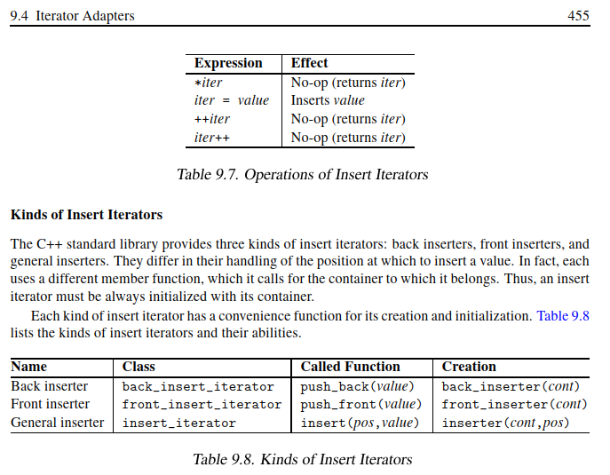

# Insert Iterators

## Learning Objectives

After completing this chapter, you should be able to:

- Explain what an Insert Iterator is
- Understand why Insert Iterators exist
- Understand how Insert Iterators transform assignment into insertion
- Understand `std::back_insert_iterator`
- Understand `std::front_insert_iterator`
- Understand `std::insert_iterator`
- Use the helper functions:
  - `std::back_inserter()`
  - `std::front_inserter()`
  - `std::inserter()`
- Explain why STL algorithms remain generic when using Insert Iterators
- Answer common Insert Iterator interview questions

---
# Motivation

Consider:

```cpp
std::vector<int> src{1,2,3,4};

std::vector<int> dest;
```

Suppose we write:

```cpp
std::copy(
    src.begin(),
    src.end(),
    dest.begin());
```
Problem:

dest is empty

There are no elements to overwrite.

Using:

```cpp
*result = *first;
```
would be invalid.

Yet this works:

```cpp
std::copy(
    src.begin(),
    src.end(),
    std::back_inserter(dest));
```

Why?

Because:

```cpp
back_inserter(dest)
```

does not return a normal iterator.

It returns an Insert Iterator.

# What Is an Insert Iterator?

An Insert Iterator is an **Output Iterator adapter** that transforms assignment operations into insertion operations.

Normally:

```cpp
*pos = value;
```

means:

```text
Overwrite an existing element
```

With an Insert Iterator:

```cpp
*pos = value;
```

means:

```text
Insert a new element into the container
```

instead of replacing an existing element.

This allows STL algorithms to grow containers dynamically while remaining completely generic.

---

# The Key STL Idea

Algorithms do not know how insertion occurs.

For example, `std::copy()` simply performs:

```cpp
*result = *first;
```

For a normal iterator this means:

```text
Overwrite an existing element
```

For an Insert Iterator this means:

```text
Insert a new element
```

The algorithm remains unchanged.

Only the iterator changes.

This is one of the most elegant design ideas in the STL.

---

# How Insert Iterators Work

Insert Iterators use a clever implementation technique.




---

## Step 1: operator*() Does Nothing

For Insert Iterators:

```cpp
*iter
```

does not return a container element.

Instead it returns the iterator itself.

Conceptually:

```cpp
operator*()
{
    return *this;
}
```

Therefore:

```cpp
*iter = value;
```

effectively becomes:

```cpp
iter = value;
```

---

## Step 2: operator=() Performs Insertion

The assignment operator is overloaded.

Instead of storing a value:

```cpp
iter = value;
```

it performs an insertion operation.

Depending on the iterator type:

```cpp
push_back(value);
```

or:

```cpp
push_front(value);
```

or:

```cpp
insert(position,value);
```

is called.

This is the operation that actually inserts the element.

---

## Step 3: operator++() Does Nothing

For Insert Iterators:

```cpp
++iter
```

and:

```cpp
iter++
```

are usually no-ops.

Conceptually:

```cpp
operator++()
{
    return *this;
}
```

The insertion position is managed internally by the adapter.

---

# Operations of Insert Iterators

| Expression | Effect |
|------------|---------|
| `*iter` | No-op (returns iterator) |
| `iter = value` | Inserts value |
| `++iter` | No-op |
| `iter++` | No-op |

Unlike normal iterators, Insert Iterators do not traverse container elements.

---

# Types of Insert Iterators

The STL provides three Insert Iterator adapters:

```text
Insert Iterators
│
├── back_insert_iterator
├── front_insert_iterator
└── insert_iterator
```

---

# back_insert_iterator

## Purpose

Inserts elements at the end of a container.

Uses:

```cpp
container.push_back(value);
```

---

## Helper Function

Normally we create it using:

```cpp
std::back_inserter(container)
```

rather than constructing it directly.

---

## Example

```cpp
std::vector<int> src{1,2,3,4};

std::vector<int> dest;

std::copy(
    src.begin(),
    src.end(),
    std::back_inserter(dest));
```

Result:

```text
1 2 3 4
```

Conceptually:

```cpp
dest.push_back(1);
dest.push_back(2);
dest.push_back(3);
dest.push_back(4);
```

---

## Requirements

The container must provide:

```cpp
push_back()
```

Examples:

```cpp
std::vector
std::deque
std::list
std::string
```

---

# front_insert_iterator

## Purpose

Inserts elements at the front of a container.

Uses:

```cpp
container.push_front(value);
```

---

## Helper Function

```cpp
std::front_inserter(container)
```

---

## Example

```cpp
std::list<int> src{1,2,3};

std::list<int> dest;

std::copy(
    src.begin(),
    src.end(),
    std::front_inserter(dest));
```

Result:

```text
3 2 1
```

---

## Why Is the Order Reversed?

Assignments become:

```cpp
dest.push_front(1);
dest.push_front(2);
dest.push_front(3);
```

Result:

```text
3 2 1
```

Each new element is inserted before the previous elements.

---

## Requirements

The container must provide:

```cpp
push_front()
```

Examples:

```cpp
std::list
std::deque
std::forward_list
```

Not:

```cpp
std::vector
```

because vectors do not provide:

```cpp
push_front()
```

---

# insert_iterator

## Purpose

Inserts elements at a specified position.

Uses:

```cpp
container.insert(position,value);
```

---

## Helper Function

```cpp
std::inserter(container, position)
```

---

## Example

```cpp
std::vector<int> v{1,2,5,6};

auto pos = v.begin() + 2;

std::vector<int> src{3,4};

std::copy(
    src.begin(),
    src.end(),
    std::inserter(v, pos));
```

Result:

```text
1 2 3 4 5 6
```

---

## Why Does insert_iterator Advance the Position?

After inserting an element:

```cpp
position =
    container.insert(position,value);
```

the iterator advances:

```cpp
++position;
```

This ensures that subsequent insertions occur after the newly inserted element.

Thus:

```text
1 2 3 4 5 6
```

is produced rather than:

```text
1 2 4 3 5 6
```

or another unexpected ordering.

---

## Associative Containers

For associative containers such as:

```cpp
std::set
std::multiset

std::map
std::multimap
```

the supplied position is only a hint.

The container ultimately determines the correct position according to its ordering rules.

Example:

```cpp
std::set<int> s{10,20,30};

std::vector<int> src{1,2,3};

std::copy(
    src.begin(),
    src.end(),
    std::inserter(
        s,
        s.begin()));
```

Result:

```text
1 2 3 10 20 30
```

---

# Visual Summary

### Normal Iterator

```cpp
*iter = value;
```

↓

```text
Overwrite existing element
```

---

### back_insert_iterator

```cpp
*iter = value;
```

↓

```cpp
container.push_back(value);
```

---

### front_insert_iterator

```cpp
*iter = value;
```

↓

```cpp
container.push_front(value);
```

---

### insert_iterator

```cpp
*iter = value;
```

↓

```cpp
container.insert(position,value);
```

---

# Relationship to Output Iterators

Insert Iterators are specialized Output Iterators.

Algorithms such as:

```cpp
std::copy()
```

use them exactly as they would use any other Output Iterator:

```cpp
*result = value;
```

The difference is that assignment is translated into insertion rather than overwriting an existing element.

---

# Interview Questions

## Q1

What is an Insert Iterator?

**Answer:**

An Output Iterator adapter that transforms assignment into insertion.

---

## Q2

Why are Insert Iterators classified as Output Iterators?

**Answer:**

Because they support writing values to a destination but do not provide meaningful read access.

---

## Q3

Which helper function creates a Back Insert Iterator?

**Answer:**

```cpp
std::back_inserter()
```

---

## Q4

Why does:

```cpp
std::copy(
    src.begin(),
    src.end(),
    std::back_inserter(dest));
```

work when `dest` is empty?

**Answer:**

Because assignment through the Insert Iterator becomes:

```cpp
dest.push_back(value);
```

instead of overwriting existing elements.

---

## Q5

Why does:

```cpp
std::front_inserter()
```

reverse element order?

**Answer:**

Because each new element is inserted at the front of the container.

---

## Q6

Why are:

```cpp
++iter
iter++
```

typically no-ops?

**Answer:**

Because Insert Iterators do not traverse container elements. The insertion position is handled internally by the adapter.

---

## Q7

What operation does `insert_iterator` perform?

**Answer:**

```cpp
container.insert(position,value)
```

---

# Key Takeaways

1. Insert Iterators are Output Iterator adapters.
2. They transform assignment into insertion.
3. `operator*()` typically returns the iterator itself.
4. `operator++()` and `operator++(int)` are usually no-ops.
5. `back_insert_iterator` uses `push_back()`.
6. `front_insert_iterator` uses `push_front()`.
7. `insert_iterator` uses `insert()`.
8. Insert Iterators allow STL algorithms to grow containers automatically.
9. STL algorithms remain generic because insertion behavior is implemented by the iterator adapter rather than the algorithm itself.